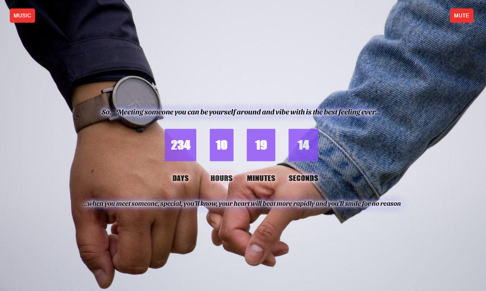

# Meet Me (Romantic timer)

> My project from hw of GOIT.

Additional description about the project and its features.

## Built With

- Major language - 
- Technologies used    

## Live Demo

[Live Demo Link](https://yaroslav-uaa.github.io/goit-js-hw-11-timer-ua/#)

## Authors

👤 **Yaroslav_Ua**

## Show your support

Give a ⭐️ if you like this project!

### Prerequisites

If you really want to be remembered, you must send this timer to the person you
want to meet.

### Setup

1. fork this repository
2. Open it in code editor.
3. npm install
4. In plugin.js - choose needed Date in 47 line!
5. npm run deploy;
6. Sent active page for your person)
7. If you wnat to impove this Timer, write me Discord - YAroslav_Ua#3935
